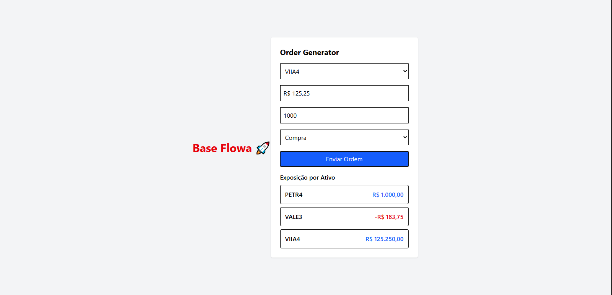
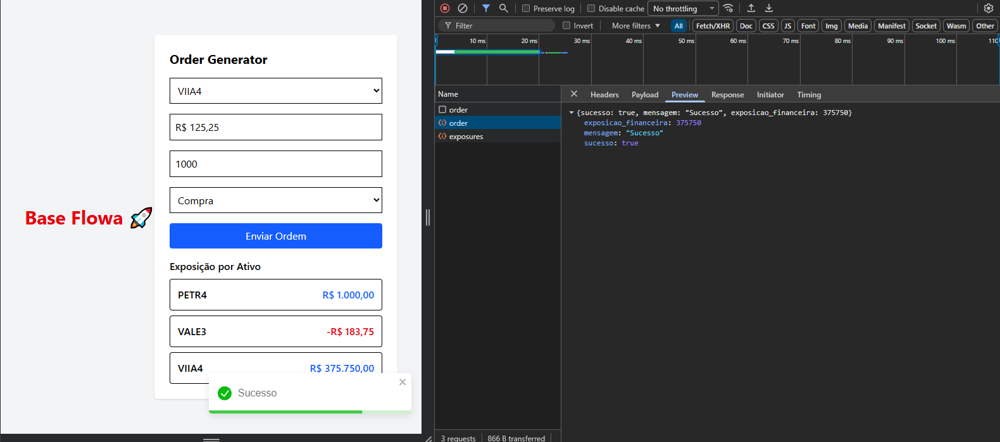
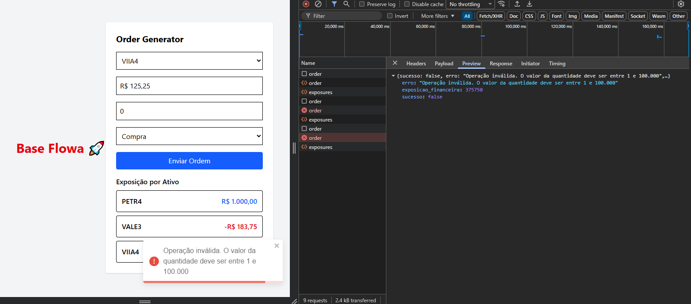

# 📊 Order Accumulator

Aplicação **full stack** composta por um **backend em Node.js** e um **frontend em React**, desenvolvida para simular o acúmulo de ordens de compra e venda e o cálculo de **exposição financeira por ativo**, seguindo boas práticas de arquitetura, organização de código e testes automatizados. Esse repositório é o frontend da aplicação **OrderGenerator** do meu Github. 

# Frontend
- Formulário de criação de ordens
- Máscara de moeda brasileira (R$)
- Listagem de exposição financeira por ativo
- Feedback visual com Toasts (sucesso / erro)
- Interface responsiva e estilizada

## 🚀 Tecnologias Utilizadas
  - React
  - Vite
  - Tailwind CSS
  - React Toastify
  - Integração com API REST

## 🎨 Instalação
  
      git clone https://github.com/g-molin4/OrderGenerator.git
      cd OrderGenerator
      npm install
      npm run dev

## 📷 Imagens

